<a href="https://github.com/x2Swiftyouz">
  <picture>
    <source media="(prefers-color-scheme: dark)" srcset="dark_mode.svg">
    <source media="(prefers-color-scheme: light)" srcset="light_mode.svg">
    
  </picture>
</a>

### 🚀 Projects
- **[Bot-Ai-Discord](https://github.com/x2Swiftyouz/Bot-Ai-Discord)** – AI chat bot for Discord
- **[Bot-Music](https://github.com/x2Swiftyouz/Bot-Music)** – Music bot for Discord
- **[Akati-Os](https://github.com/x2Swiftyouz/Akati-Os)** – PowerShell project
